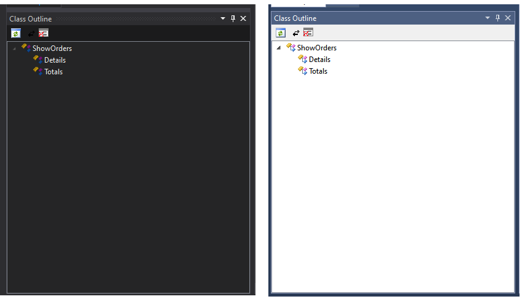

ClassOutline

Tool Window for Visual Studio 2013/2015 that displays the class hierarchy of the current editor window in a Tree.
Note, supports c# only.

The right-click menu also has shortcuts for:
All constructors
All Run() methods
All regions
All Views

# Apr 2020 (issue #12)
Added support for themes, many thanks to https://stackoverflow.com/questions/51181319/how-can-i-match-visual-studios-theme-when-creating-a-vsix-tool-window

Demonstration of Light and Dark themes

